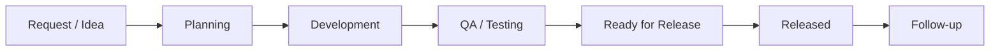

# SpotOn IT Delivery Workspace Challenge

> Build a real full-stack software delivery workspace in 2 days using Next.js, NestJS, PostgreSQL, authentication, workflow rules, QA checks, releases, scoring, and AI-assisted development.


## Demo Video

📹 [Watch the demo video](https://drive.google.com/drive/folders/1oC8uOL6fIvMNxQcJ4MH-ix35k28hZSWJ?usp=drive_link)

## Implementation Status

All 5 levels were completed, plus one creative feature.

| Level | Status |
| --- | --- |
| 1 — Core Work Items | ✅ Complete |
| 2 — Workflow and Ownership | ✅ Complete |
| 3 — QA Checks | ✅ Complete |
| 4 — Release Notes | ✅ Complete |
| 5 — Score, Tests, Polish | ✅ Complete |
| Creative Feature | ✅ Engineering Timeline |

See `DECISIONS.md` for full design rationale, `AI_USAGE.md` for how AI tools were used, and `PROMPT_LOG.md` for the detailed build log.

## Setup Notes (What Changed From the Starter)

The starter had no ORM and no `.env`-loading mechanism configured. The following was added to make the project runnable end to end:

- **`.env` is required.** Copy `.env.example` to `.env` at the **repo root** before starting the API — the database connection string, JWT secret, and frontend API base URL are all read from there. The backend loads it via `dotenv` (added as a dependency).
- **No manual migration step needed.** The full database schema is defined in `backend-nest/src/database/schema.sql` and is applied automatically and idempotently (`CREATE TABLE IF NOT EXISTS`) every time the API starts — so `npm run dev:api` alone is enough to get a fully migrated database, no separate migration command required.
- **Postgres must be running first** (via `docker compose up -d postgres`) before starting the API, since schema application happens on API startup.

If you're on Windows, avoid running this project from inside a OneDrive-synced folder — it can cause the TypeScript build output to silently fail to write. Use a plain local path instead.

## Table of Contents

- [At a Glance](#at-a-glance)
- [Mission](#mission)
- [What You Are Building](#what-you-are-building)
- [Starter Project](#starter-project)
- [Quick Start](#quick-start)
- [Core Modules](#core-modules)
- [Workflow Rules](#workflow-rules)
- [Level System](#level-system)
- [Creative Feature](#creative-feature)
- [Score System](#score-system)
- [Codebase Investigation](#codebase-investigation)
- [Recommended Delivery Approach](#recommended-delivery-approach)
- [Technical Standards](#technical-standards)
- [AI Prompt Logging](#ai-prompt-logging)
- [GitHub Submission Expectations](#github-submission-expectations)
- [Submission Checklist](#submission-checklist)
- [Demo Video Guide](#demo-video-guide)
- [What We Value](#what-we-value)

## At a Glance

| Icon | Area | Expectation |
| --- | --- | --- |
| 🕒 | Time | 2 days |
| 🎯 | Main goal | Build the IT Delivery Workspace |
| ⚛️ | Frontend | Next.js and React |
| 🧱 | Backend | NestJS REST API |
| 🗄️ | Database | PostgreSQL |
| 🧩 | Required modules | Work Items, QA Checks, Release Notes |
| 🤖 | AI usage | Allowed, documented, and reviewed |
| ✅ | Strong signal | Clean workflow rules, useful UX, tests, prompt log |

## Mission

You are working on a simplified internal product called **SpotOn Project Engine**.

The IT/software team needs an **IT Delivery Workspace** to manage the software engineering lifecycle:



Your task is to turn the starter IT Workspace into a useful production-style module.

This is not only a CRUD task. We want to see how you think about:

- workflow design
- backend business rules
- database relationships
- frontend usability
- score/reward behavior
- debugging and investigation
- AI-assisted development judgment

## What You Are Building

The workspace should help an IT/software team answer:

| Question | Product Area |
| --- | --- |
| What are we building or fixing? | IT Work Items |
| Who owns each item? | Assignment and My Work |
| What stage is each item in? | Workflow status |
| What still needs QA? | QA Checks |
| What is ready to release? | Release readiness |
| What shipped, when, and in which version? | Release Notes |
| Which engineering actions should earn points? | Score System |

## Starter Project

This repository is a simplified assessment project. It is not the production codebase.

| Folder | Meaning |
| --- | --- |
| `frontend-next` | Web App, built with Next.js and React |
| `backend-nest` | API Server, built with NestJS |
| `docker-compose.yml` | PostgreSQL service |

The starter contains:

- login page
- basic JWT auth
- basic score page and score API
- blank IT Workspace route for your product design
- placeholder IT Workspace API endpoints
- PostgreSQL Docker service

The IT Workspace route is deliberately minimal. Use it as your canvas. You may design the module layout, navigation, cards, tables, boards, forms, dashboards, and detail pages in the way you think best supports the workflow.

## Quick Start

### 1. Install Dependencies

```bash
npm run install:all
```

### 2. Set up environment variables

Copy the example env file at the repo root:

```bash
cp .env.example .env
```

### 3. Start PostgreSQL

```bash
docker compose up -d postgres
```

### 4. Start The API

```bash
npm run dev:api
```

The database schema is created automatically on startup — no separate migration step is needed. Look for `Database schema ensured.` in the terminal output to confirm it worked.

API URL:

```txt
http://localhost:3001
```

### 5. Start The Web App

Open another terminal:

```bash
npm run dev:web
```

Web URL:

```txt
http://localhost:3000
```

### 6. Login

```txt
Email: intern@spoton.test
Password: intern123
```

### 7. Run Tests (optional)

```bash
cd backend-nest
npm test
```

## Existing Project Map

Use the starter as a small product shell. You are free to add files, routes, components, services, DTOs, tests, and database helpers as needed.

| Area | What Exists | What You Can Do |
| --- | --- | --- |
| Login | `frontend-next/src/app/login/page.tsx`, `backend-nest/src/auth/*` | Keep it, improve UX/errors if needed, protect new routes/APIs |
| App shell | `frontend-next/src/app/pm/layout.tsx` | Add navigation for Work Items, QA, Releases, dashboards, or detail pages |
| Workspace canvas | `frontend-next/src/app/pm/it-workspace/page.tsx` | Design the full workspace experience from scratch |
| Score | `frontend-next/src/app/pm/score/page.tsx`, `backend-nest/src/score/*` | Connect score events to meaningful workflow actions |
| Workspace API | `backend-nest/src/it-workspace/*` | Replace placeholders with real endpoints and backend rules |
| Database | PostgreSQL service in `docker-compose.yml` | Add schema/tables/migrations or a clear setup script for your data model |
| Docs | `AI_USAGE_TEMPLATE.md`, `PROMPT_LOG_TEMPLATE.md`, `DECISIONS_TEMPLATE.md` | Copy templates into final submission files and fill them in |

You may change the visual design of the IT Workspace completely. Keep login and the basic app shell usable, but the workspace itself should reflect your own product thinking.

## Core Modules

Build three connected modules.

## 1. IT Work Items

A work item represents a software feature, bug, improvement, or maintenance task.

### Required Fields

| Field | Notes |
| --- | --- |
| `title` | short clear title |
| `description` | enough detail for implementation/testing |
| `type` | `feature`, `bug`, `improvement`, `maintenance` |
| `status` | `backlog`, `planned`, `in_progress`, `qa`, `ready_for_release`, `released` |
| `priority` | `low`, `medium`, `high`, `urgent` |
| `assignee` | assigned user/person |
| `dueDate` | target date |
| `createdBy` | creator |
| `createdAt` / `updatedAt` | timestamps |

### Required Behavior

- Create, list, view, update, and delete work items.
- Persist work items in PostgreSQL.
- Protect APIs with authentication.
- Add search and filters for status, priority, assignee, and text.
- Add a `My Work` view or filter.
- Show clear loading, empty, error, and success states.

## 2. QA Checks

QA checks represent testing and quality control for a work item.

### Required Fields

| Field | Notes |
| --- | --- |
| `workItemId` | linked work item |
| `testTitle` | what is being tested |
| `expectedResult` | expected behavior |
| `actualResult` | observed behavior |
| `status` | `pending`, `passed`, `failed` |
| `tester` | person who tested |
| `notes` | optional context |
| `createdAt` / `updatedAt` | timestamps |

### Required Behavior

- Add QA checks to a work item.
- Mark checks as `pending`, `passed`, or `failed`.
- Show QA progress on list and detail views.
- Block release readiness unless all QA checks are passed.
- Treat zero QA checks as not ready for release.

## 3. Release Notes

Release notes represent deployment planning and shipped work.

### Required Fields

| Field | Notes |
| --- | --- |
| `version` | example: `v1.2.0` |
| `releaseDate` | planned or actual release date |
| `summary` | short release summary |
| `deploymentStatus` | `draft`, `scheduled`, `deployed`, `rolled_back` |
| `linkedWorkItems` | ready work items included in the release |
| `createdAt` / `updatedAt` | timestamps |

### Required Behavior

- Create, list, and view releases.
- Link ready work items to a release.
- Only `ready_for_release` work items can be linked.
- When a release becomes `deployed`, linked work items become `released`.
- Show which work shipped in each release.

## Workflow Rules

Backend services must protect workflow rules. The frontend should guide the user, but the backend must enforce correctness.

Expected happy path:

```txt
backlog -> planned -> in_progress -> qa -> ready_for_release -> released
```

Reasonable backward movement is allowed when it supports real engineering work:

```txt
qa -> in_progress
ready_for_release -> qa
```

Invalid examples:

- `backlog` directly to `released`
- `in_progress` directly to `ready_for_release` without QA
- `ready_for_release` while QA is failed or pending
- adding a non-ready item to a release
- deploying the same release twice for duplicate score points

## Level System

You are not expected to finish every level. The challenge is layered. A clean Level 3 is better than an unstable Level 5.

| Level | Name | Expected Outcome |
| ---: | --- | --- |
| 1 | Core Work Items | Authenticated CRUD, PostgreSQL persistence, useful pages/forms |
| 2 | Workflow and Ownership | Valid transitions, assignees, My Work, history, search/filters |
| 3 | QA Checks | QA states, QA progress, backend readiness rule |
| 4 | Release Notes | Releases, linked ready work, deployment behavior |
| 5 | Score, Tests, Polish | Score integration, idempotency, tests, polished UX |

Suggested approach:

1. Finish Level 1 cleanly.
2. Add backend workflow rules before UI polish.
3. Add QA readiness rules before release deployment.
4. Add score events only after the workflow is reliable.
5. Add the creative feature after the main flow works.

## Creative Feature

Add one creative feature that makes this feel like a real engineering tool. It should improve planning, QA, release safety, or follow-up. It should not be decoration only.

Choose one or invent your own:

| Idea | What It Should Do |
| --- | --- |
| Release Readiness Board | Show exactly what blocks each item from release |
| QA Risk Meter | Calculate risk from priority, failed QA, overdue date, missing assignee |
| Engineering Timeline | Show item progress from idea to release with activity events |
| Smart Next Action | Recommend the next practical action from current workflow state |
| Deployment Checklist | Prevent deployment until checklist items are complete |
| AI-Ready Brief | Generate a concise implementation brief from item details and QA notes |
| Post-Release Review | Capture what shipped, what failed, and follow-up tasks |

**Implemented:** Engineering Timeline — a unified, chronological feed on each work item's detail page combining status changes and QA check activity, showing exactly how the item progressed from creation to release.

## Score System

The starter has a basic score API/page. Extend it in a meaningful way.

Suggested score events:

| Action | Points |
| --- | ---: |
| Create a useful work item | +1 |
| Move a work item to QA | +1 |
| Complete a QA check | +1 |
| Move a work item to ready for release | +2 |
| Deploy a release | +3 |

Important rule:

- Prevent duplicate points for the same action on the same entity.

Example: clicking deploy twice should not award deploy points twice.

**Implemented:** all 5 events above, with idempotency enforced via a `UNIQUE (action, entity_type, entity_id)` database constraint on `score_events`.

## Codebase Investigation

Before building:

1. Run the project.
2. Inspect the frontend and backend structure.
3. Identify what needs to change for the IT Delivery Workspace.
4. Fix blockers that affect your implementation.
5. Document important decisions in `DECISIONS.md`.

Do not spend your whole time on unrelated cleanup. Prioritize what matters for this module.

## Recommended Delivery Approach

A strong submission usually follows this order:

| Step | Focus | Why It Matters |
| ---: | --- | --- |
| 1 | Run and inspect the starter | Shows debugging and codebase navigation |
| 2 | Design the database schema | Prevents fragile feature work later |
| 3 | Build Work Items end to end | Creates the first real vertical slice |
| 4 | Add backend workflow rules | Protects the system from invalid data |
| 5 | Add QA Checks | Proves relationship modeling and validation |
| 6 | Add Release Notes | Tests multi-entity workflow behavior |
| 7 | Add score events | Rewards meaningful actions after rules are stable |
| 8 | Add tests and polish | Makes the solution reliable and reviewable |
| 9 | Add one creative feature | Shows product thinking beyond instructions |

Good engineering tradeoff: finish a small reliable flow before expanding the surface area.

## Technical Standards

### Backend

- Use NestJS controllers, services, and DTOs.
- Store module data in PostgreSQL.
- Keep business rules in backend services.
- Protect APIs with authentication.
- Validate input.
- Return consistent error messages.
- Avoid hardcoded fake data for completed features.

### Frontend

- Build real product screens, not a landing page.
- Keep the workflow easy to understand.
- Handle loading, empty, error, and success states.
- Keep the UI responsive.
- Make forms clear and practical.
- Keep visual design clean and consistent with the starter.

### Database

- Design tables with sensible relationships.
- Use stable IDs.
- Track created/updated timestamps.
- Avoid storing the whole module as one unstructured JSON blob.
- Think about constraints that protect workflow rules.

### Git

- Use clear commits.
- Do not commit secrets or real `.env` files.
- Keep unrelated changes out of the submission.
- Include setup notes if commands or environment variables changed.

## AI Prompt Logging

AI tools are allowed. We care about how you use them and how well you review the result.

You must submit:

- `AI_USAGE.md`, based on `AI_USAGE_TEMPLATE.md`
- `PROMPT_LOG.md`, based on `PROMPT_LOG_TEMPLATE.md`

### Prompt Logging Rules

Best practical method:

1. Start `PROMPT_LOG.md` before coding.
2. Work in small AI-assisted slices.
3. Commit after each meaningful slice.
4. Add the commit hash to the prompt-log entry.
5. In `AI_USAGE.md`, summarize the big patterns and mistakes.

For each meaningful AI-assisted step, log:

- timestamp
- tool used
- goal
- exact prompt or a faithful summary if the prompt included private context
- AI output summary
- files changed because of that output
- what you manually reviewed or corrected
- related commit hash, if available

If your AI tool supports exporting chats, you may also include exported transcripts in an `ai-transcripts/` folder. Do not include secrets, tokens, passwords, private keys, or personal data.

Good AI usage is not about asking AI to do everything. Good AI usage means you can explain the code, reject weak suggestions, test the result, and make clear engineering decisions.

## GitHub Submission Expectations

Use GitHub like a real engineering handoff:

- Keep commits readable and grouped by feature or fix.
- Do not commit secrets, local database dumps, or real `.env` files.
- Update setup instructions if you change commands or environment variables.
- Keep generated files out of the repository.
- Explain important tradeoffs in `DECISIONS.md`.
- Reference related prompt-log entries when a major feature was AI-assisted.

Recommended commit style examples:

```txt
feat: add work item persistence
feat: enforce QA readiness rule
feat: add release deployment flow
test: cover invalid work item transitions
docs: add setup notes and limitations
```

## Submission Checklist

Submit a GitHub repository link or pull request link.

Your submission should include:

- [x] working setup instructions
- [x] short demo video, 3-5 minutes
- [x] `AI_USAGE.md`
- [x] `PROMPT_LOG.md`
- [x] `DECISIONS.md`
- [x] tests added and commands run
- [x] known limitations or unfinished levels
- [x] no committed secrets

## Demo Video Guide

In your demo, show:

1. Login.
2. Create a work item.
3. Move it through at least part of the workflow.
4. Show QA behavior if implemented.
5. Show release behavior if implemented.
6. Show score behavior if implemented.
7. Show your creative feature if implemented.
8. Mention what you would improve next.

📹 See the [Demo Video](#demo-video) section at the top of this README for the recording.

## What We Value

We value:

- working vertical slices
- clear backend rules
- clean database thinking
- practical UI decisions
- readable code
- good debugging judgment
- honest AI usage
- ability to explain tradeoffs

A smaller complete solution is better than a large unstable one.